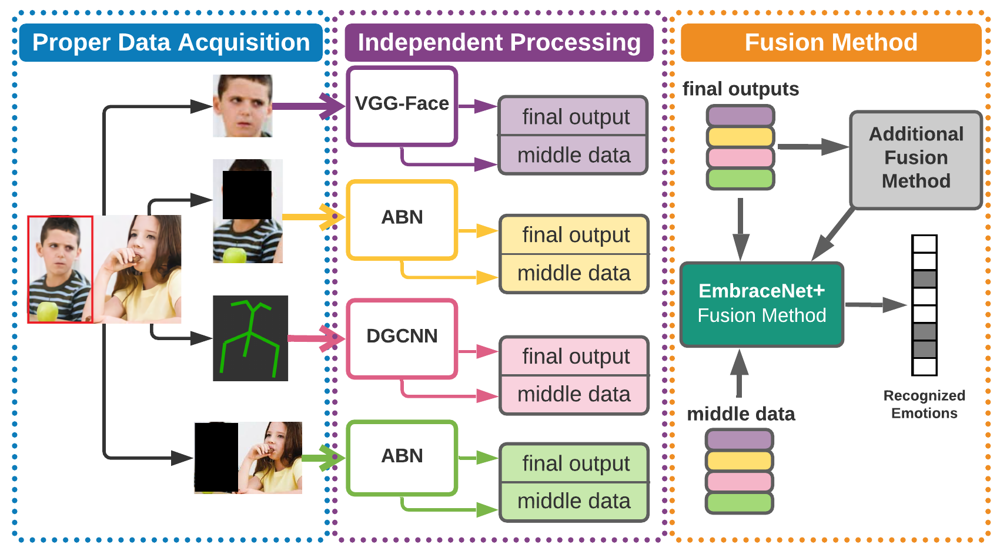
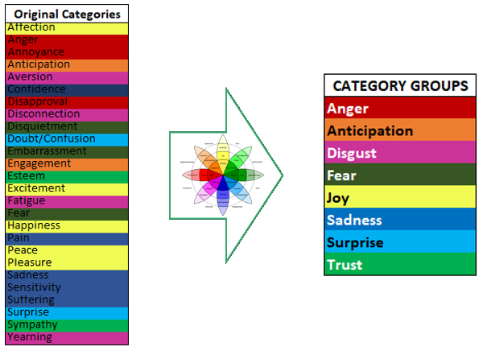

# A Multi-modal Visual Emotion Recognition Method to Instantiate an Ontology

The goal of this project is to recognise emotions in most situations. For this, four kinds of data are taken: face, posture, body and context/environment features. Each of these are processed independently and then combined with a merging method called EmbraceNet+, wich is an extention of the [EmbraceNet](https://github.com/idearibosome/embracenet).



This repository include the fully implementation of the multi-modal method in a Google Colab environment, its training and performed tests.

> **Disclaimer**: Due to lack of resources and time, the code was not tested locally. Perhaps the notebooks available will help with errors.

## Requeriments
- pytorch >= 1.6
- CUDA 10.1
- mxnet-cu101
- insightface
- numpy
- cv2
- tqdm
- pandas
- sklearn

## Data Used


<!--  -->

The used data are shared [here](https://drive.google.com/file/d/1JAGejLFaymrIsq44icV42IdaAdydSdk9/view?usp=sharing), this zip contains all the data for each modality in numpy array format.

This dataset is acquire form the original [EMOTIC dataset](http://sunai.uoc.edu/emotic/download.html).

Moreover, the number of annotated emotions in EMOTIC (26) were reduced by grouping, following the taxonomy of Mr. Plutchik, into eight groups.



The weighted random sampler from pytorch was used in training time trying to solve the unbalancing of the EMOTIC dataset.

## Execution

### Google Colab
- First notebook, [EmbraeNet_Plus.ipynb](https://github.com/juan1t0/multimodalDLforER/blob/master/EmbraeNet_Plus.ipynb), contains the EMOTIC procesing, modalities input adequation, and the training and test of four independent modalities and of the multi-modal method.
- Second notebook, [Demo_n_other_evals.ipynb](https://github.com/juan1t0/multimodalDLforER/blob/master/Demo_n_other_evals.ipynb), contains the procedures for carry out the inferences of the test results, and the procedures for fully use of the method, from input image to get the output, calculating the execution time.

### Local
The file tree must look like this:

```
  multimodalDLforER
  |-checkpoints
  | |-models
  | | |-bodyabn_last.pth
  | | |-contextabn_best.pth
  | | |-facevgg_best.pth
  | | \\-posedgcnn_ws_last.pth
  | |-checkpoints
  | | \\...
  | |-thresholds
  | | |-thresholds_validation.npy
  | | \\...
  | |-YOLO
  | | |-YOLO-weights
  | | | \\...
  | | |-coco.names
  | | \\...
  | \\...
  | |-hrnet_w48_384x288.pth
  | \\...
  |-configs
  | |-embracenet_plus.json
  | \\...
  |-EMOTIC
  | \\...
  |-models
  | |-utils
  | | \\..
  | \\...
  |-utils
  | \\...
  \\-processor.py
```
 
#### Training
```bash
  python processor.py -l checkpoints/models/ -o train -d EMOTIC/ -c configs/embracenet_plus.json -g 0 -s checkpoints/ebnplus -v
```
#### Test
```bash
  python processor.py -p -l checkpoints/models/ -m checkpoints/checkpoints/ebnplus -o test -d EMOTIC/ -c configs/embracenet_plus.json -g 0 
```
#### Inference
```bash
  python processor.py -p -l checkpoints/models/ -m checkpoints/checkpoints/ebnplus -o inference -c configs/embracenet_plus.json -g 0 -i img.png -h checkpoints/thresholds/thresholds_validation.npy
```

## Acknowledgments
This research was supported by the FONDO NACIONAL DEDESARROLLO CIENTÍFICO, TECNOLÓGICO Y DE INNOVACIÓN TECNOLÓGICA - FONDECYT as executing entity of CONCYTEC under grant agreement no.01-2019-FONDECYT-BM-INC.INV in the project RUTAS: Robots for Urban Tourism,Autonomous and Semantic web based.
